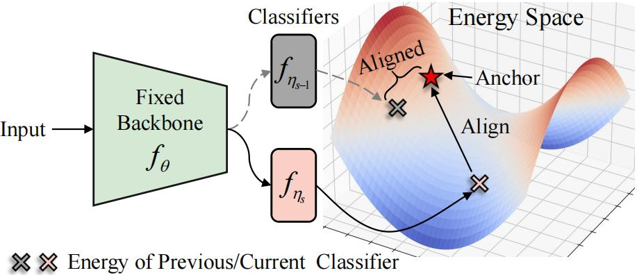

# Isolation and Impartial Aggregation: A Paradigm of Incremental Learning without Interference

<div align="justify">
  This is the official implementation of our AAAI 2023 paper "Isolation and Impartial Aggregation: A Paradigm of Incremental Learning without Interference".
This paper focuses on the prevalent stage interference and stage performance imbalance of incremental learning. To avoid obvious stage learning bottlenecks, we propose a new incremental learning framework, which leverages a series of stage-isolated classifiers to perform the learning task at each stage, without interference from others. To be concrete, to aggregate multiple stage classifiers as a uniform one impartially, we first introduce a temperature-controlled energy metric for indicating the confidence score levels of the stage classifiers. We then propose an anchor-based energy self-normalization strategy to ensure the stage classifiers work at the same energy level. Finally, we design a voting-based inference augmentation strategy for robust inference. The proposed method is rehearsal-free and can work for almost all incremental learning scenarios. We evaluate the proposed method on four large datasets. Extensive results demonstrate the superiority of the proposed method in setting up new state-of-the-art overall performance.
</div>


**Isolation and Impartial Aggregation: A Paradigm of Incremental Learning without Interference** <br>
Yabin Wang*, Zhiheng Ma*, Zhiwu Huang, Yaowei Wang, Zhou Su, Xiaopeng Hong. 2023 Proceedings of the AAAI Conference on Artificial Intelligence (AAAI 23). <br>
[[Paper]](https://arxiv.org/abs/2211.15969)

## Introduction

<div align="justify">


In this paper, we propose anchor-based energy self-normalization for stage classifiers. 
The classifiers of the current and the previous stages, $f_{\eta_s}$ and $f_{\eta_{s-1}}$, are aligned sequentially by restricting their energies around the anchor
</div>




## Enviroment setup
Create the virtual environment for ESN.
```python
conda env create -f environment.yaml
```
After this, you will get a new environment **esn** that can conduct ESN experiments.  
Run `conda activate esn` to activate.

Note that only NVIDIA GPUs are supported for now, and we use NVIDIA RTX 3090. 

## Dataset preparation
Please refer to the following links to download three standard incremental learning benchmark datasets.   
[CIFAR-100] Auto Download  
[CORe50](https://vlomonaco.github.io/core50/index.html#dataset)  
[DomainNet](http://ai.bu.edu/M3SDA/)  
[5-Datasets] 

Unzip the downloaded files, and you will get the following folders.

```
core50
└── core50_128x128
    ├── labels.pkl
    ├── LUP.pkl
    ├── paths.pkl
    ├── s1
    ├── s2
    ├── s3
    ...
```

```
domainnet
├── clipart
│   ├── aircraft_carrier
│   ├── airplane
│   ... ...
├── clipart_test.txt
├── clipart_train.txt
├── infograph
│   ├── aircraft_carrier
│   ├── airplane
│   ... ...
├── infograph_test.txt
├── infograph_train.txt
├── painting
│   ├── aircraft_carrier
│   ├── airplane
│   ... ...
... ...
```

## Training:

Please change the `data_path` in `utils/data.py` to the locations of the datasets.

### Split-CIFAR100:
```
python main.py --dataset cifar100_vit --max_epochs 30 --init_cls 10 --inc_cls 10 --shuffle
```

### Split-DomainNet:
```
python main.py --dataset domainnet --max_epochs 10 --init_cls 20 --inc_cls 20 --shuffle
```

### CORe50:
```
python main.py --dataset core50 --max_epochs 10 --init_cls 50 --inc_cls 50 --dil True --max_cls 50
```

### 5-Datasets:
```
python main.py --dataset 5datasets_vit --max_epochs 10 --init_cls 10 --inc_cls 10 
```

## Model Zoo:

Pretrained models will be available soon.

We assume the downloaded weights are located under the `checkpoints` directory.

Otherwise, you may need to change the corresponding paths in the scripts.


[comment]: <> (## Results)

[comment]: <> (![results1.png]&#40;results1.png&#41;)

[comment]: <> (![results2.png]&#40;results2.png&#41;)

[comment]: <> (![results3.png]&#40;results3.png&#41;)

## License

Please check the MIT  [license](./LICENSE) that is listed in this repository.

## Acknowledgments

We thank the following repos providing helpful components/functions in our work.

- [S-Prompts](https://github.com/iamwangyabin/S-Prompts)
- [PyCIL](https://github.com/G-U-N/PyCIL)

## Citation

If you use any content of this repo for your work, please cite the following bib entry:
```
@article{wang2022isolation,
  title={Isolation and Impartial Aggregation: A Paradigm of Incremental Learning without Interference},
  author={Wang, Yabin and Ma, Zhiheng and Huang, Zhiwu and Wang, Yaowei and Su, Zhou and Hong, Xiaopeng},
  booktitle={Proceedings of the AAAI Conference on Artificial Intelligence},
  year={2023}
}
```
